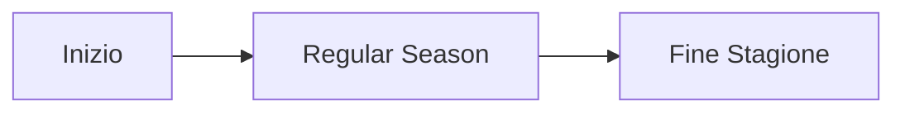
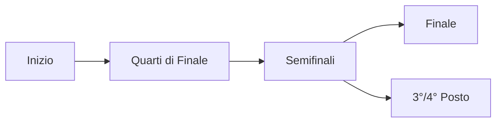
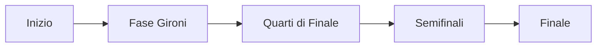
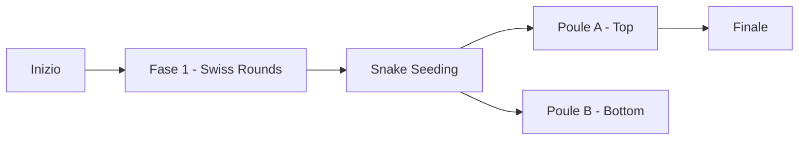
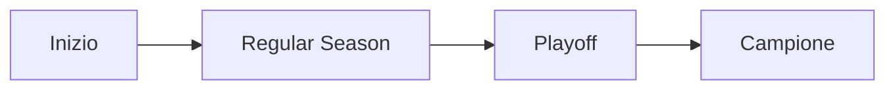

# Sistema Modalità Torneo - Documentazione Tecnica

## Indice

1. [Panoramica](#panoramica)
2. [Modalità Disponibili](#modalità-disponibili)
3. [Architettura](#architettura)
4. [Configurazione Admin](#configurazione-admin)
5. [Integrazione Database](#integrazione-database)
6. [Guida Sviluppatori](#guida-sviluppatori)
7. [Troubleshooting](#troubleshooting)

---

## Panoramica

NCL App supporta un sistema flessibile di modalità torneo basato su **handler pattern**. Ogni modalità è un handler indipendente che definisce:

- **Fasi del torneo** (es. stagione regolare, playoff)
- **Algoritmo generazione partite** (round-robin, knockout, swiss)
- **Calcolo classifiche** con sistema punti configurabile
- **Criteri spareggio** (tie-breakers) personalizzabili
- **Regole avanzamento** tra fasi

### Principi Architetturali

```
┌─────────────────────────────────────────────────────────────┐
│                    Handler Registry                          │
│  ┌──────────────┐  ┌──────────────┐  ┌──────────────┐       │
│  │ LeagueOnly   │  │   Knockout   │  │ GroupsKnock  │  ...  │
│  │   Handler    │  │   Handler    │  │   Handler    │       │
│  └──────────────┘  └──────────────┘  └──────────────┘       │
└─────────────────────────────────────────────────────────────┘
                              │
                              ▼
┌─────────────────────────────────────────────────────────────┐
│                    Tournament Mode                           │
│  ┌──────────────────────────────────────────────────────┐   │
│  │ handler_key: "league_only"                           │   │
│  │ settings: { pointsPerWin: 3, tieBreakers: [...] }    │   │
│  └──────────────────────────────────────────────────────┘   │
└─────────────────────────────────────────────────────────────┘
                              │
                              ▼
┌─────────────────────────────────────────────────────────────┐
│                        Season                                │
│  ┌──────────────────────────────────────────────────────┐   │
│  │ tournament_mode_id: "uuid"                           │   │
│  │ teams: [...]                                         │   │
│  └──────────────────────────────────────────────────────┘   │
└─────────────────────────────────────────────────────────────┘
```

---

## Modalità Disponibili

### 1. Solo Campionato (League Only)

**Handler Key:** `league_only`

**Flusso Fasi:**

```mermaid
graph LR
    A[Inizio] --> B[Regular Season]
    B --> C[Fine Stagione]
```

**Descrizione:** Formato round-robin classico dove tutte le squadre si affrontano. Ideale per piccole leghe (6-12 squadre).

**Settings:**

| Parametro | Tipo | Default | Descrizione |
|-----------|------|---------|-------------|
| `pointsPerWin` | number | 3 | Punti per vittoria |
| `pointsPerDraw` | number | 1 | Punti per pareggio |
| `pointsPerLoss` | number | 0 | Punti per sconfitta |
| `doubleRoundRobin` | boolean | true | Andata e ritorno |
| `tieBreakers` | string[] | `['head_to_head', 'goal_difference', 'goals_scored']` | Ordine criteri spareggio |

**Pro e Contro:**

| Pro | Contro |
|-----|--------|
| Semplice da implementare | Molte partite per leghe grandi |
| Equo - tutti giocano contro tutti | Nessuna fase eliminazione |
| Ideale per piccole leghe | Può diventare noioso se il leader è deciso presto |

**Numero Partite:**
- Single round-robin: `n * (n-1) / 2` partite
- Double round-robin: `n * (n-1)` partite

Esempio con 8 squadre: 28 partite (singolo) o 56 partite (doppio).

---

### 2. Eliminazione Diretta (Knockout)

**Handler Key:** `knockout`

**Stato:** 🚧 In sviluppo (Fase 3)

**Flusso Fasi (8 squadre):**

```mermaid
graph LR
    A[Inizio] --> B[Quarti di Finale]
    B --> C[Semifinali]
    C --> D[Finale]
    C --> E[3°/4° Posto]
```

**Settings:**

| Parametro | Tipo | Default | Descrizione |
|-----------|------|---------|-------------|
| `bracketSize` | 4\|8\|16\|32 | 8 | Dimensione bracket |
| `seedingMethod` | string | 'random' | Metodo seeding (random, seeded, manual) |
| `thirdPlaceMatch` | boolean | false | Partita 3°/4° posto |
| `doubleElimination` | boolean | false | Doppia eliminazione |

---

### 3. Gironi + Playoff (Groups + Knockout)

**Handler Key:** `groups_knockout`

**Stato:** 🚧 In sviluppo (Fase 4)

**Flusso Fasi (12 squadre, 4 gironi):**

```mermaid
graph LR
    A[Inizio] --> B[Fase Gironi]
    B --> C[Quarti di Finale]
    C --> D[Semifinali]
    D --> E[Finale]
```

**Settings:**

| Parametro | Tipo | Default | Descrizione |
|-----------|------|---------|-------------|
| `groupCount` | number | 4 | Numero gironi |
| `teamsPerGroup` | number | 4 | Squadre per girone |
| `advancingPerGroup` | number | 2 | Squadre che avanzano |
| `knockoutSettings` | object | {...} | Configurazione fase knockout |

---

### 4. Swiss System

**Handler Key:** `swiss_system`

**Stato:** 🚧 In sviluppo (Fase 5)

**Flusso Fasi:**

```mermaid
graph LR
    A[Inizio] --> B[Fase 1 - Swiss Rounds]
    B --> C[Snake Seeding]
    C --> D[Poule A - Top]
    C --> E[Poule B - Bottom]
    D --> F[Finale]
```

**Settings:**

| Parametro | Tipo | Default | Descrizione |
|-----------|------|---------|-------------|
| `phase1Rounds` | number | 5 | Turni fase 1 |
| `snakeSeedingPattern` | number[][] | [[1,4,5,8], [2,3,6,7]] | Pattern divisione poule |
| `pouleFormat` | string | 'round_robin' | Formato poule |

---

### 5. Campionato + Finale (Round Robin + Final)

**Handler Key:** `round_robin_final`

**Stato:** 🚧 In sviluppo (Fase 6)

**Flusso Fasi:**

```mermaid
graph LR
    A[Inizio] --> B[Regular Season]
    B --> C[Playoff]
    C --> D[Campione]
```

**Settings:**

| Parametro | Tipo | Default | Descrizione |
|-----------|------|---------|-------------|
| `leagueSettings` | LeagueOnlySettings | {...} | Config campionato |
| `playoffTeams` | 2\|4\|8 | 4 | Squadre nei playoff |
| `playoffFormat` | string | 'single_match' | Formato playoff |
| `thirdPlaceMatch` | boolean | true | Finale 3°/4° posto |

---

## Architettura

### Struttura File

```
src/
├── types/
│   ├── tournament-handlers.ts    # Interfacce handler
│   └── tournament-settings.ts    # Tipi settings
├── lib/
│   └── tournament/
│       ├── handler-registry.ts   # Registry + factory
│       ├── schemas.ts            # Zod validation
│       └── handlers/
│           ├── league-only.ts    # Handler League Only
│           ├── knockout.ts       # (Fase 3)
│           └── ...
└── components/
    └── admin/
        └── tournament-settings/
            ├── index.tsx                  # Form router
            ├── LeagueOnlySettingsForm.tsx # Form League Only
            └── TieBreakersConfig.tsx      # Drag-and-drop tie-breakers
```

### Interfaccia TournamentHandler

```typescript
interface TournamentHandler {
  key: TournamentHandlerKey;
  nameKey: string;           // Chiave i18n per nome
  descriptionKey: string;    // Chiave i18n per descrizione
  phases: PhaseConfig[];
  defaultSettings: TournamentModeSettings;

  validateSettings(settings: unknown, teamCount?: number): ValidationResult;
  generateMatches(context: MatchGenerationContext): MatchGenerationResult;
  calculateStandings(context: StandingsContext): LeagueTableRow[];
  getNextPhase(context: PhaseTransitionContext): PhaseConfig | null;
  getAdvancingTeams(standings: LeagueTableRow[], rules?: AdvancementRule[]): string[];
}
```

### Interfaccia PhaseConfig

```typescript
interface PhaseConfig {
  id: string;                    // Es: 'regular_season', 'quarter-final'
  nameKey: string;               // Chiave i18n
  order: number;                 // Ordine visualizzazione
  matchGeneration: {
    type: 'round_robin' | 'knockout' | 'swiss_pairing';
  };
  advancementRules?: AdvancementRule[];
  isTerminal: boolean;           // Fase finale?
}
```

### Handler Registry

```typescript
// Registrare un handler
registerHandler(LeagueOnlyHandler);

// Ottenere un handler
const handler = getHandler('league_only');

// Ottenere tutti i metadata
const allHandlers = getAllHandlerMetadata();

// Ottenere fasi per un handler
const phases = getHandlerPhases('league_only');

// Ottenere settings default
const defaults = getDefaultSettings('league_only');
```

---

## Configurazione Admin

### Creazione Modalità Torneo

1. Navigare a **Admin > Modalità Torneo**
2. Cliccare **Nuova Modalità Torneo**
3. Inserire nome descrittivo (es. "Campionato Primavera 2025")
4. Selezionare formato tramite le card visuali
5. Configurare settings specifiche:
   - **Sistema Punti**: Vittoria/Pareggio/Sconfitta
   - **Formato Partite**: Andata e ritorno
   - **Criteri Spareggio**: Drag-and-drop per ordinare
6. Salvare

### Creazione Stagione con Modalità

1. Navigare a **Admin > Stagioni**
2. Cliccare **Nuova Stagione**
3. Selezionare la modalità torneo creata
4. Selezionare le squadre partecipanti
5. Verificare eventuali warning (es. troppe squadre)
6. Salvare

### Generazione Calendario

1. Navigare a **Admin > Generatore Calendario**
2. Selezionare stagione (mostra la modalità associata)
3. Selezionare fase (dinamica in base alla modalità)
4. Configurare vincoli:
   - Giorni permessi
   - Orari partite
   - Campi disponibili
   - Andata e ritorno
5. Generare anteprima
6. Confermare e salvare

---

## Integrazione Database

### Tabelle Coinvolte

```sql
-- Tournament Modes
CREATE TABLE tournament_modes (
  id uuid PRIMARY KEY DEFAULT gen_random_uuid(),
  name text NOT NULL,
  handler_key text NOT NULL,          -- Es: 'league_only'
  settings jsonb DEFAULT '{}',        -- Settings tipizzate
  created_at timestamptz DEFAULT now()
);

-- Seasons (riferimento a tournament_mode)
CREATE TABLE seasons (
  id uuid PRIMARY KEY DEFAULT gen_random_uuid(),
  name text NOT NULL,
  start_date date,
  end_date date,
  tournament_mode_id uuid REFERENCES tournament_modes(id),
  created_at timestamptz DEFAULT now()
);

-- Matches (stage dinamico)
CREATE TABLE matches (
  id uuid PRIMARY KEY DEFAULT gen_random_uuid(),
  season_id uuid REFERENCES seasons(id),
  home_team_id uuid REFERENCES teams(id),
  away_team_id uuid REFERENCES teams(id),
  stage text NOT NULL,                -- Es: 'regular_season', 'quarter-final'
  round integer,
  home_score integer,
  away_score integer,
  status text DEFAULT 'scheduled',
  match_date timestamptz
);
```

### Query Utili

```typescript
// Fetch stagione con modalità torneo
const { data } = await supabase
  .from('seasons')
  .select('*, tournament_modes(id, name, handler_key, settings)')
  .eq('id', seasonId)
  .single();

// Fetch partite per stage
const { data: matches } = await supabase
  .from('matches')
  .select('*')
  .eq('season_id', seasonId)
  .eq('stage', 'regular_season');
```

---

## Guida Sviluppatori

### Aggiungere una Nuova Modalità

1. **Creare il file handler:**

```typescript
// src/lib/tournament/handlers/my-handler.ts
import type { TournamentHandler } from '@/types/tournament-handlers';
import { registerHandler } from '../handler-registry';

export const MyHandler: TournamentHandler = {
  key: 'my_handler',
  nameKey: 'tournament.modes.myHandler.name',
  descriptionKey: 'tournament.modes.myHandler.description',
  phases: [
    {
      id: 'phase1',
      nameKey: 'tournament.phases.phase1',
      order: 0,
      matchGeneration: { type: 'round_robin' },
      isTerminal: false,
    },
    // ... altre fasi
  ],
  defaultSettings: {
    // ... settings default
  },

  validateSettings(settings, teamCount) {
    // Validazione
    return { valid: true, errors: [] };
  },

  generateMatches(context) {
    // Generazione partite
    return { success: true, matches: [] };
  },

  calculateStandings(context) {
    // Calcolo classifica
    return [];
  },

  getNextPhase(context) {
    // Logica transizione
    return null;
  },

  getAdvancingTeams(standings, rules) {
    // Squadre che avanzano
    return [];
  },
};

// Auto-registrazione
registerHandler(MyHandler);
```

2. **Aggiungere schema Zod:**

```typescript
// src/lib/tournament/schemas.ts
export const myHandlerSettingsSchema = z.object({
  // ... definizione schema
});
```

3. **Creare form settings:**

```typescript
// src/components/admin/tournament-settings/MyHandlerSettingsForm.tsx
export const MyHandlerSettingsForm = ({ value, onChange, disabled }) => {
  return (
    // ... form JSX
  );
};
```

4. **Registrare nel form router:**

```typescript
// src/components/admin/tournament-settings/index.tsx
case 'my_handler':
  return <MyHandlerSettingsForm value={...} onChange={...} />;
```

5. **Aggiungere chiavi i18n:**

```json
// src/locales/it/translation.json
{
  "tournament": {
    "modes": {
      "myHandler": {
        "name": "Mia Modalità",
        "description": "Descrizione della modalità"
      }
    }
  }
}
```

6. **Aggiornare tipi:**

```typescript
// src/types/tournament-handlers.ts
export type TournamentHandlerKey =
  | 'league_only'
  | 'knockout'
  | 'my_handler'  // Aggiungere qui
  | ...;
```

### Testing

```typescript
// Test validazione settings
describe('MyHandler', () => {
  it('should validate settings correctly', () => {
    const result = MyHandler.validateSettings({
      // ... settings
    });
    expect(result.valid).toBe(true);
  });

  it('should generate matches', () => {
    const result = MyHandler.generateMatches({
      teams: [...],
      phase: {...},
      settings: {...},
    });
    expect(result.success).toBe(true);
    expect(result.matches.length).toBeGreaterThan(0);
  });
});
```

---

## Troubleshooting

### Problemi Comuni

**Q: Le fasi non appaiono nel PhaseVisualizer**

A: Verificare che:
1. La stagione abbia un `tournament_mode_id` valido
2. La modalità torneo abbia un `handler_key` registrato
3. L'handler sia importato (auto-registrazione)

```typescript
// Verificare registrazione
import '@/lib/tournament/handlers/league-only';
console.log(getHandler('league_only')); // Deve restituire l'handler
```

**Q: I tab in Tables.tsx non cambiano**

A: Le fasi vengono caricate dinamicamente. Verificare:
1. La query `useSeasonWithTournamentMode` restituisca dati
2. Il `handler_key` sia corretto nel database

**Q: Settings non salvate correttamente**

A: Verificare che le settings passino la validazione Zod:

```typescript
import { leagueOnlySettingsSchema } from '@/lib/tournament/schemas';

const result = leagueOnlySettingsSchema.safeParse(settings);
if (!result.success) {
  console.error(result.error.issues);
}
```

**Q: Errore "Handler not found"**

A: L'handler non è registrato. Assicurarsi che il file sia importato:

```typescript
// In un entry point (es. App.tsx o handler-registry.ts)
import '@/lib/tournament/handlers/league-only';
import '@/lib/tournament/handlers/knockout'; // quando implementato
```

### Debug

```typescript
// Log tutti gli handler registrati
console.log('Registered handlers:', getAllHandlerMetadata());

// Log fasi per un handler
console.log('Phases:', getHandlerPhases('league_only'));

// Log settings default
console.log('Defaults:', getDefaultSettings('league_only'));
```

---

## Generazione Calendario Event-Mode

### Panoramica Algoritmo

La modalità "Per Evento" utilizza un algoritmo multi-tentativo per generare calendari ottimali. L'edge function (`supabase/functions/match-scheduler/index.ts`) esegue fino a **24 tentativi** con PRNG deterministico (Mulberry32) e seleziona il risultato con il miglior punteggio di qualità.

### SharedEventState

Per garantire coerenza tra più eventi nella stessa generazione, tutte le funzioni condividono uno stato:

```typescript
interface SharedEventState {
  timeSlotTeams: Map<string, Set<string>>;  // squadre impegnate per slot (cross-evento)
  refereeCounts: Map<string, number>;        // arbitraggi cumulativi
  teamMatchCounts: Map<string, number>;      // partite cumulative per bilanciamento
  matchupCounts: Map<string, number>;        // matchup cumulativi per evitare ripetizioni
}
```

Questo stato è creato una volta per tentativo e aggiornato in-place da ogni funzione.

### Vincoli Hard vs Soft

| Vincolo | Tipo | Descrizione |
|---------|------|-------------|
| Conflitto arbitro-giocatore | **Hard** | L'arbitro non può essere una squadra che gioca nello stesso slot. Garantito dall'assegnazione post-match. |
| Back-to-back (slot consecutivo) | **Hard** | Una squadra non può giocare in due slot consecutivi. |
| Near-back-to-back (gap adattivo) | **Hard** | Con `avoidBackToBack` attivo, il gap è calcolato da `computeEffectiveGap(teamCount, venueCount)`: massimo 2 slot, ridotto automaticamente se la configurazione non lo consente (es. 10 sq + 2 campi → gap=1). Garantisce sempre il massimo riempimento degli slot senza back-to-back diretti. |
| Evita ripetizioni matchup | **Quasi-hard** | Le coppie "fresh" (mai giocate) hanno sempre priorità via tiered sorting (`repeatTier`). I repeat solo quando nessuna coppia fresh soddisfa i vincoli. |
| Bilanciamento partite | **Soft** | Bonus scoring proporzionale al deficit: `(maxCount - teamCount) * 100` per squadra. |
| Bilanciamento arbitraggi | **Soft** | L'arbitro viene scelto tra le squadre con meno arbitraggi cumulativi. |

### Flusso di Generazione per Evento

1. **`generateEventSlots()`** — Calcola gli slot temporali disponibili per evento
2. **`generateEventPairings()`** — Genera gli accoppiamenti con tiered sorting (fresh > repeat) e bilanciamento potenziato
3. **`assignMatchesToSlots()`** — Piazza le partite negli slot rispettando i vincoli hard (back-to-back, gap 2 slot). Aggiorna `SharedEventState`.
4. **`assignReferees()`** — Assegna arbitri **dopo** tutti i match dell'evento. Raggruppa match per slot, identifica squadre impegnate, assegna solo da squadre libere con bilanciamento cross-evento.
5. **`scoreScheduleQuality()`** — Calcola punteggio qualità considerando ripetizioni (pre-esistenti + intra-generazione), back-to-back basato su tempo reale, bilanciamento partite e arbitraggi.

### Convergence Detection

L'algoritmo si ferma prima dei 24 tentativi se:
- Viene trovato un calendario con punteggio perfetto (0 penalità)
- 3 tentativi consecutivi producono lo stesso punteggio (convergenza)

### Test Automatici

Il file `supabase/functions/match-scheduler/test-scheduler.ts` contiene test automatici per 4 scenari:
- Scenario A: 10 squadre, 2 campi (caso reale)
- Scenario B: 6 squadre, 1 campo (scenario ridotto)
- Scenario C: 10 squadre, 2 eventi cross-evento
- Scenario D: 4 squadre, caso molto vincolato

Esecuzione: `npx tsx supabase/functions/match-scheduler/test-scheduler.ts`

---

## Roadmap

| Fase | Modalità | Stato |
|------|----------|-------|
| 1 | Infrastruttura Core | ✅ Completata |
| 2 | League Only | ✅ Completata |
| 3 | Knockout | 🚧 In sviluppo |
| 4 | Groups + Knockout | 📋 Pianificata |
| 5 | Swiss System Refactor | 📋 Pianificata |
| 6 | Round Robin + Final | 📋 Pianificata |

---

## Riferimenti

- [Piano Implementazione Completo](../.claude/plans/quirky-crafting-papert.md)
- [CLAUDE.md - Convenzioni Progetto](../CLAUDE.md)
- [TypeScript Interfaces](../src/types/tournament-handlers.ts)
- [Handler Registry](../src/lib/tournament/handler-registry.ts)
